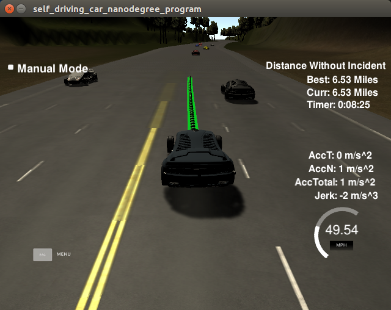

# CarNDPathPlanningP3

In this Project a car is to be directed around a simulator course as fast as possible while (hopefully) avoiding collisions with other vehicles. The current state of the vehicle as well as state information from the other cars is provided by the simulator: The task is then to compute the next course steps for the vehicle and to send them back to the simulator. The main part of my program is implemented in the vehicle class which has the following methods:

* check collision: here the planned path of my own vehicle is compared with the predicted paths of the surrounding vehicles (if they are in relevant lines for the next maneouver steps of my car). In case of a collision the function returns true. The function is called from the choose_next_state method in order to determine if certain actions are feasible.

* choose_next_state: basically the car always tries to stay in its lane and go as fast as the speed limit allows. If this is not possible (checked with checked collision method) the car tries a left lane change then a right line change and - if none of the above is possible - reduces speed.

* predict: here the trajectories of the surrounding cars are prediced (it is assumed that they stay in their curren lane and maintain their current velocity).

* MPC_plan (not used currently): can be currently used for lane keeping and should also brake if a car in front is detected (by setting the constraints in MPC.cpp accordingly).

* JMT: the path planner from the video tutorial which is used to compute the next vehicle path steps.

The figure gives an example that with the current implementation the car is able to drive around the course without accident for quite some time:

